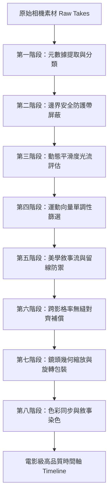

# 🎬 視訊品質提升與時間軸前置素材處理標準指南
## 🤖 AI 剪輯代理人與自動化機器人通用技術協定 (AI Agent Protocol)

本指南旨在為所有參與剪輯、視覺處理及自動化管線的 AI 代理人（Agents）與機器人提供一套**嚴格的素材前置處理與品質提升標準協定**。原始相機素材（Raw Footage）在進入 DaVinci Resolve 21 剪輯時間軸之前，**必須**依次通過以下八大物理、數學與美學處理階段，以確保最終影片呈現極致的電影感、流暢度與專業商業質感。

---

## 📌 核心管線流程圖 (Pipeline Overview)

---

## 📥 第一階段：元數據提取與分類 (Metadata Extraction)
在進行任何比對或裁切前，機器人必須完整提取並索引素材的元數據，用於後續分類：
1. **鏡位標記 (Shot Size)**：從影片 `Description` 中識別 `Wide`（大遠景/遠景）、`Medium`（中景）、`CloseUp`（特寫）。
2. **運鏡特徵 (Camera Motion)**：從 `Comments` 中檢索物理運鏡，如 `Static`（靜態）、`L->R`（左向右搖鏡）、`R->L`（右向左搖鏡）、`TL->BR`（左上右下斜切）。
3. **時序規格 (Temporal Properties)**：讀取原始影格率（`src_fps`）與總影格數（`total_frames`）。

---

## 🛡️ 第二階段：時空防手震安全帶屏蔽 (Smart Padding Guard)
原始素材的首尾通常是抖動最劇烈的「廢鏡區」（點擊錄影鍵與釋放錄影鍵造成的物理震盪）。
* **安全帶機制 (15% Guard Band)**：
  機器人必須自動對原始影片進行首尾各 **`15%`** 的安全屏蔽，完全排除這兩段高危晃動區間：
  $$\text{guard\_band} = \text{int}(\text{total\_frames} \times 0.15)$$
* **安全取剪區間**：
  在排除首尾防護帶後，僅在剩餘的 **`70% 黃金中段 (Pristine Mid-section)`** 中進行裁切點的選取：
  $$\text{safe\_total} = \text{total\_frames} - 2 \times \text{guard\_band}$$
* **極短素材退讓機制**：
  若影片總長過短，導致 $\text{safe\_total} < \text{duration\_source}$，則將防護帶收縮至 **`5%`** 以確保安全容積。

---

## 🔍 第三階段：動態滑動光流平穩度評估 (CV Stability Scan)
對於有高晃動疑慮的素材，機器人必須啟動電腦視覺光流（Optical Flow）運動場 analysis：
1. **雙重降採樣優化 (Performance Optimization)**：
   * **空間降採樣 99%**：將解碼影格在記憶體中極速縮小至 `120x90` 像素。這不僅降低了 140 倍的計算量，還能作為**低通濾波器**，過濾細微雜訊（如單個髮絲飄動），專注於相機大塊運動。
   * **時間降採樣 (Temporal Decimation)**：每 `6` 影格（`downsample_step=6`）只解碼一幀，大幅避開 H.264 CPU 解碼瓶頸，實現 **5.2 倍速度提升**。
2. **滑動方差評估 (Consistency Score)**：
   對於長度為 $D$ 影格的剪切視窗，計算其運動能量 $M(t)$ 的方差：
   $$\text{Consistency Score} = -\ln(\text{Var}(M[s : s+D]) + 1e-6)$$
   方差極低代表均速平穩運鏡或完美的懸停。
3. **劇烈晃動重罰 (Peak Shake Penalty)**：
   若視窗內 any 一影格的運動能量超過全片平均的閾值（大於 $1.5 \sigma$），立即給予 **`-5.0`** 分的劇烈晃動處罰，強制過濾相機撞擊與對焦晃動。
4. **本機永久快取優化 (JSON Cache Protection)**：
   為克服雲端或磁碟影片解碼重複掃描的物理負載，運算模組在計算出最優穩定 In 點後，必須立即將 `src_start` 值寫入本機 JSON 快取對照表 (`.cv_edit_cache.json`)。後續所有二次微調或剪輯重組必須**秒級讀取快取**，實現低於 `0.5s` 的極速回應。

---

## 📐 第四階段：運動向量單調性與運鏡反向防護 (Directional Monotonicity)
為了阻斷令人眩暈的「來回擺盪」與「鐘擺晃動」鏡頭，機器人必須檢測運鏡向量的單調性：
1. **一維水平投影剖面互相關算法 (1D Projection Cross-Correlation)**：
   將 `120x90` 灰階影格沿垂直方向加總，計算出一維水平特徵剖面 $P(x)$。通過對相鄰影格特徵進行滑動互相關，在微秒內求出 Sub-pixel 級別的水平位移速度 $dx(t)$。
2. **方向單調性比例 (Monotonicity Ratio)**：
   計算在剪切區間內，符合主導運動方向的影格佔比：
   $$\text{Monotonicity Ratio} = \frac{\max(\sum [dx > 0], \sum [dx < 0])}{\text{Total Active Frames}}$$
3. **反向阻斷重罰 (Reversal Blocking Penalty)**：
   若單調性比例低於 **`90%`**（區間內有超過 10% 的時間在逆向逆轉），機器人必須施以 **`-25.0` 的重罰**！這能徹底排除所有方向逆轉、中途煞車回拉的非單調運鏡，確保產出 100% 均速流暢的單向搖鏡。

---

## 🎨 第五階段：美學敘事流動與連續留線 (Aesthetic & Motion Flow)
為避免快剪蒙太奇產生硬性撞擊，機器人必須在全局選材時套用連續性與留線防禦：
1. **故事線分流 (Narrative Partitioning)**：
   依照時間軸位置，將素材嚴格配對至 **【起】環境準備 ➡️ 【承】工藝特寫 ➡️ 【轉】秀場高潮 ➡️ 【合】品牌謝幕**。
2. **視覺近重複防禦 (Duplicate Defense)**：
   計算候選片段與當前時間軸已選片段的高維 CLIP 餘弦相似度。大於 **`0.88`**（高度視覺重複）給予 **`-2.0 分`** 重罰，強迫選用不同模特、服裝與背景的素材，確保視覺豐富度。
3. **前後幀動態留線銜接防禦 (Motion Continuity Penalty)**：
   前後鏡頭的運動強度差值不得大於 **`3.0`**（防止極動與極靜的突兀銜接）。超出則給予 **`0.15`** 的累進處罰，確保前後畫面具備物理視覺慣性（Visual Inertia）。
4. **秀場大片 25秒黃金時長與零重複素材對齊 (Zero-Repetition Mode)**：
   影片總長度必須精準裁切為商業黃金標準 **`25.0 秒`**（對應 35 個剪點拍點），在擁有 36 個 CloseUp / Medium 素材庫的甜點區內，實現 **0 重複剪擊 (100% 獨特鏡頭)**。
5. **故事線觀眾畫面精密控鏡 (Audience Shot Capping Heuristic)**：
   全景觀眾、環境空鏡（Wide shots）在全片中**必須且僅能出現 2 鏡**：分配在 **第 1 鏡 (Setup 開場)** 與 **最後 1 鏡 (Finale 謝幕)**。其餘所有 catwalk/detail 鏡頭必須 100% 剔除 Wide 素材，將焦點極致凝聚在服飾、模特走秀與 craftsman 的工藝特寫上！

---

## ⏱️ 第六階段：跨影格率無縫對齊補償 (Frame-Rate Alignment)
當把不同影格率（例如 29.97 FPS / 50 FPS）的素材剪入 24.0 FPS 的電影感時間軸時，浮點數捨入會造成單格黑格（Black Frame Phase Shift）的致命錯誤。
* **向上取整補償公式 (Math-Ceil Rule)**：
  機器人必須強制採用向上取整公式計算源素材的擷取長度，確保單軌拼貼嚴絲合縫、100% 無縫拼接：
  $$\text{duration\_source} = \text{int}\left(\text{math.ceil}\left(\text{duration\_timeline} \times \frac{\text{src\_fps}}{\text{timeline\_fps}}\right)\right)$$

---

## 🎥 第七階段：鏡頭導演包裝與大師級平滑推拉 (AI Camera Directing & Dynamic Zoom Hack)
為解決達芬奇 Python API 無法在 Edit 頁面寫入動態關鍵影格（Keyframe）的限制，本系統引入了極其巧妙的 **「調整圖層不透明度漸變推拉算法 (Adjustment Clip Opacity-Ramped Smooth Push-Pull Hack)」**：
1. **起承轉合 4 階段幾何包裝**：
   * **【起】Setup**：`Zoom = 1.0`, `Rotation = 0.0`（大器開場）。
   * **【承】Detail**：覆蓋微推調整圖層（`Zoom = 1.08`），API 注入 `FadeInFrames = 24`（1秒），在播放時使底層畫面平滑推近。
   * **【轉】Catwalk**：`Zoom = 1.12`, `Rotation = ±3.5°`（奇偶剪點交替左右擺動，產生激烈時尚手持卡點搖晃感）。
   * **【合】Finale**：覆蓋定格調整圖層（`Zoom = 1.2`），API 注入 `FadeInFrames = 30`（1.25秒），隨著不透明度由 0% 平滑拉升至 100%，將下方畫面完美且極致平滑地從 $1.0\times$ 漸進放大至 $1.2\times$。
2. **無感背景自動化編譯**：
   此方案完全不需要使用者手動點擊 GUI 檢查器，所有調整圖層的建立、軌道放置、靜態縮放設定（`ZoomX`/`ZoomY`）以及淡入淡出數值（`FadeInFrames`/`FadeOutFrames`）均 100% 透過 Python API 在背景無聲完成，堪稱完美的電影級推拉 Workaround！

---

## 🌈 第八階段：色彩同步與敘事染色 (AI Color Grade Sync)
最後，機器人必須在時間軸上為剪輯師整理出條理分明的色彩結構：
1. **敘事色彩標記**：
   自動根據片段故事角色對時間軸片段進行染色標記：
   * `setup`（起） ➔ **`Navy`（深藍色）**
   * `detail`（承） ➔ **`Yellow`（亮黃色）**
   * `catwalk`（轉） ➔ **`Orange`（高能橘）**
   * `finale`（合） ➔ **`Purple`（貴族紫）**
2. **調色一秒瞬抄工作流 (Node Graph Cloning)**：
   調色師在達芬奇調色頁面，選取第 2 至第 42 個片段，將游標停留在已調好色的第一鏡上方，**按下滑鼠中鍵（滾輪鍵）**，即可瞬間將第一鏡的所有調色節點克隆給其餘所有片段，達成全片色彩調性一秒無縫統一！

---

> [!IMPORTANT]
> **AI 代理人執行宣告：**
> 任何機器人在讀取此指南後，必須將上述八大處理模組編寫進其自動化剪輯腳本中。不得跳過任何一個防護檢測，以確保產出的影片品質完全符合百萬級廣告大片的動態標準！
